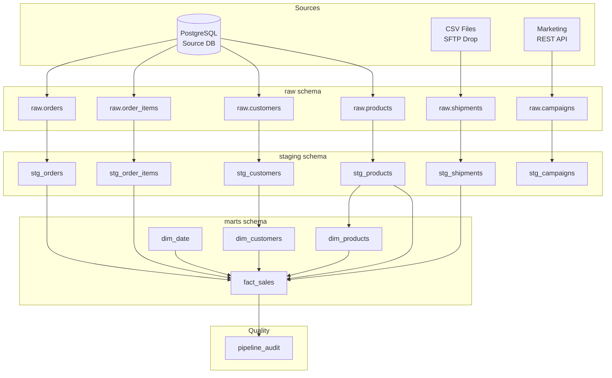

# Data Lineage

## Pipeline Flow

## Transformation Rules Summary

| From | To | Key Transformations |
|------|----|-------------------|
| raw.customers | stg_customers | Lowercase IDs, title-case names, cast dates |
| raw.orders | stg_orders | Lowercase status, filter test orders, cast types |
| raw.order_items | stg_order_items | Cast types, filter qty <= 0, add line_revenue |
| raw.shipments | stg_shipments | Normalise dates, strip carrier casing, fix weight |
| raw.campaigns | stg_campaigns | Unpack JSON array into rows |
| stg_* | fact_sales | Join all sources, calculate profit and margin |